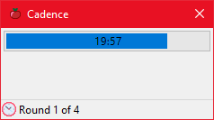
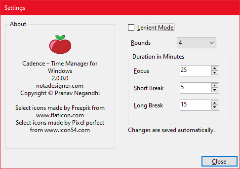

# Cadence

### Optimise Your Productivity

* Boost time awareness
* Track task hours
* Refine effort estimates
* Pinpoint productive periods
* Works 100% offline

Cadence enhances the Pomodoro Technique 🍅 by offering flexibility. It allows unscheduled breaks and extending work periods when you are close to finishing a task. Overtime is tracked separately, providing valuable data for future estimations and identifying most productive moments in the day.

The application user interface is made up of a **countdown timer** and a **context menu**. The colour of the timer changes to indicate whether it is in **focus** or **relaxed state**.

To start a new Pomodoro, **right click on the application icon in the Notification tray and select "Start"**. The application comes pre-programmed with **four 25-minute focus sessions**, each followed by a **5-minute break**. The final break is **15 minutes** long.

When a focus session ends, the application automatically transitions to a break, signalling with an **alarm bell** and a **notification message**. Once the break finishes, you will transition back to a new focus period, marked by **two alarm bells** and a notification. After your fourth focus period, the application enters a longer break, mirroring the standard Pomodoro technique.

Cadence adds key flexibility to the standard Pomodoro process:

* ⚠️ **Interruptible Focus**: You can pause focus periods whenever needed.
* 🔍 **Tracked Interruptions**: All interruptions are logged for your review.
* ⏰ **Resumable Sessions**: Resume a focus period after an interruption, with its timer resetting.
* ⚙️ **Flexible Transitions**: Choose between automatic or manual transitions for focus and break periods.
* 🤫 **Infinite Focus**: Stay in the zone with unlimited focus time when using Lenient mode.
* ❌ **Abandon Pomodoro**: Not feeling up to it right now? You have the option to abandon a Pomodoro entirely.

## Screenshots

